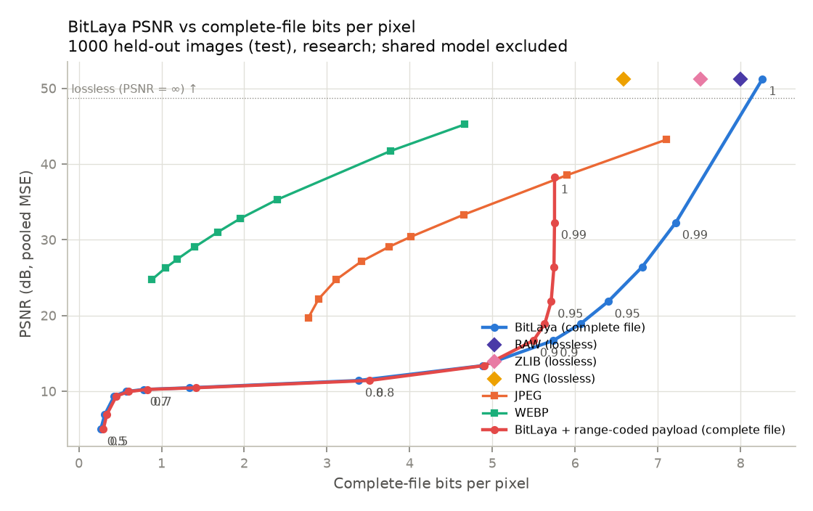

# BitLaya Milestone 1 report

Generated by `python scripts/build_report.py` from `docs/MILESTONE1_REPORT.template.md`. Every
table is the output of the command shown above it (`scripts/summarize.py` over the result
artifacts in `results/`). Measured on the GPU PC, 2026-09-24/25. Laptop results are not used
(moved to `results/laptop_cpu_partial/`).

**Sample-scale labels** (used throughout): fewer than 100 images = *smoke*, fewer than 1,000 =
*development*, 1,000 or more = *research*. All model decisions were made on the validation split
(200 images, development scale); the test split was used only for held-out reporting.

## 1. Summary

- **Final model.** Bit + bit-plane + row/col embeddings, 2-layer GRU (171,297 parameters), 1,024
  training images, teacher forcing, uniform BCE, 64,000 steps on CUDA:
  `results/objectives/bce/train/best.pt` (fingerprint `19cbf2c5f8df85f9`).
- **Lossless neural coding works; lossy omission does not.** On 1,000 test images (research),
  the range-coded lossless mode averages 5.752 bpp per complete file vs 6.590 bpp for PNG-9 and is
  smaller than PNG on 99.9% of images. Lossy omission never reaches a useful operating point: at
  26.4 dB it costs 871.9 bytes/image vs about 425 for JPEG and 136 for WebP (matched-PSNR
  interpolation), and with range-coded payloads it saves only 0.007 bpp over its own lossless mode.
- **Why lossy omission fails: error cascades.** Once an omitted bit is wrong, the next 1-8 omitted
  bits are wrong 42-50% of the time (near chance), vs 7-27% for the teacher-forced model on the same
  bits; 67-74% of later errors are induced by earlier ones.
- **Stage decisions (validation RD):** data 1,024 images > 45,000 (at this fixed budget);
  bit-plane + row/col features > bit only; teacher forcing > rollout / scheduled; uniform BCE >
  sqrt-weighted BCE. Against the preserved checkpoint on the same 1,000 test images the final model
  needs 0.36-0.87 bpp less (raw payload) and 0.88-1.37 bpp less (range-coded) for 20-35 dB.
- **Synchronization:** every one of 65,940 evaluated streams decoded independently to exactly the
  encoder's reconstruction (0 mismatches).
- **Speed:** exact engine 0.59 s/image encode, 0.59 s/image decode (median, one image, one thread),
  4.0x faster than the preserved float reference (2.36 s); batched 7.9 images/s encode.

## 2. Environment, tests, determinism

- CPU Intel Core i9-10900K (10 cores / 20 threads), 32 GB RAM, GPU NVIDIA GeForce RTX 2080 SUPER
  (8 GB, sm_75, driver 610.60), Windows 11 Pro. Python 3.11 venv, PyTorch 2.14.0+cu130 (CUDA 13.0),
  torchvision 0.29.0+cu130, NumPy 2.4.6. The desktop session (browser, VS Code, TeamViewer) stayed
  open during all measurements.
- CIFAR-10 grayscale cache content hashes equal the laptop's (train `1505ba16...`, test `e11116a8...`).
- `python -m pytest -q`: **105 passed, 0 failed, 0 skipped** (after all code changes below).
- CUDA training is run-to-run deterministic: two 100-step runs gave the same checkpoint fingerprint;
  config-identical variants in different stages (data_scaling/n01024 = position/bit_only;
  position/bit_plane_rowcol = training_modes/teacher_forcing = objectives/bce) reproduced identical
  training histories, identical checkpoints and identical sweep rows (all 2,800 per sweep).

### Code changes in this milestone (git log)

<!-- run: git log --format="- `%h` %ad %s" --date=short -->

The v1 reference codec (`codec.py`) is unchanged. The only library change is in `model.py`
(position features no longer copy indices host-to-device and sync per call; outputs bit-identical).
Everything else is tooling: `scripts/bench_train.py`, `scripts/bench_gpupc.sh`,
`scripts/build_report.py` and new `scripts/summarize.py` subcommands (`throughput`, `rate`,
`paired`, `matched`, `overhead`, `diagnose`, `sync`).

## 3. Preserved baselines (legacy checkpoint `runs/cifar_10epochs/best.pt`)

### v1 float reference codec, 100 test images (development)

<!-- run: python scripts/summarize.py sweep results/baseline_reference_v1_test100_gpupc -->

### Exact engine, v2 format, 1,000 test images (research)

<!-- run: python scripts/summarize.py sweep results/baseline_qgru_v2_test1000_gpupc -->

## 4. Throughput and budget (Step 2)

<!-- run: python scripts/summarize.py throughput results/throughput_gpupc -->

Chosen budget: 64,000 optimizer steps (10x the laptop's 6,400) at batch 32, chunk 256, LR 1e-3
constant, validation every 8,000 steps, CUDA, identical for every variant of every stage.
Teacher-forcing variants ran 3-5 at a time (one job already saturates the GPU; concurrency
costs nothing in aggregate); sweeps ran concurrently on CPU. Measured stage costs (row/col model, 3 jobs
sharing the GPU): teacher forcing 945 s per variant; rollout 32,350 s and scheduled 30,786 s,
because the sequential per-bit rollout is launch-bound.

## 5. Ablation stages (validation, 200 images, development scale)

**Decision metric.** The ablation harness's operational-envelope mean averages the PSNR gain over
0.27-8.27 bpp, most of which is 5-16 dB output nobody would use; at the position stage it disagreed
with itself between raw and range-coded payloads. From that stage on (and re-checked for data
scaling) decisions use **rate at quality**: the complete-file bpp needed for pooled PSNR >= 20, 25,
30, 35 dB, interpolated on the Pareto front linearly in (bpp, MSE), with a paired image bootstrap
(1,000 resamples) of the difference. This metric was chosen after seeing the position-stage
results; the envelope metric is reported in every `SUMMARY.md` for comparison.

### 5a. Data scaling (bit only, teacher forcing, BCE) — winner n01024

<!-- run: python scripts/summarize.py rate results/data_scaling n01024 -->

More data is **not** monotonically better at a fixed 64,000-step budget: n01024 beats n45000
(which sees only 1.4 epochs), n00032 overfits (validation BCE rises from 0.54 to 2.66 after step
8,000), and n05000 is worst although it sits between two better sizes, indicating run-to-run
variance of the same order as the data effect (single seed). Details:
`results/data_scaling/DECISION.md`, plot `results/data_scaling/comparison_rd.png`.

### 5b. Position features (train_size 1,024) — winner bit_plane_rowcol

<!-- run: python scripts/summarize.py rate results/position_ablation -->

### 5c. Training modes (bit_plane_rowcol) — winner teacher_forcing

<!-- run: python scripts/summarize.py rate results/training_modes -->

Thresholds 0.60-0.85 at matched complete-file bpp (requested focus):

<!-- run: python scripts/summarize.py matched results/training_modes 0.6 0.85 -->

Rollout makes fewer wrong omissions per threshold but spends more bits; at matched rate it wins
only at 20 dB and in the 0.80-0.85 threshold region, where every variant is below 15 dB. Confound:
checkpoints are selected by teacher-forced validation BCE, which picked scheduled at step 16,000
(4% replaced inputs). See `results/training_modes/DECISION.md`.

### 5d. Objectives (teacher forcing) — winner bce

<!-- run: python scripts/summarize.py rate results/objectives -->

## 6. Final model on held-out test data (research scale)

### RD sweep, 1,000 test images

<!-- run: python scripts/summarize.py sweep results/final_test1000 -->

RD plots: `results/final_test1000/rd_curve.png` (PSNR vs complete-file bpp with JPEG/WebP/PNG),
`rd_ssim.png`, `rd_bytes.png`, `rd_payload.png`; sample reconstructions in
`results/final_test1000/sample_reconstructions/`.

### Final model vs preserved checkpoint (same 1,000 test images)

<!-- run: python scripts/summarize.py rate results/baseline_qgru_v2_test1000_gpupc results/final_test1000 -->

### Lossless mode (threshold 1.0 + range-coded payload)

<!-- run: python scripts/summarize.py lossless results/final_lossless_test1000 -->

### Teacher-forced diagnostics (diagnostic only)

<!-- run: python scripts/summarize.py diagnose results/final_diagnose_test1000 -->

The exact engine matches float32 BCE to 6 digits on 1,000 test images. Note that for the lossless
path, teacher-forced cross-entropy *is* the rate: 0.682307 bits/bit x 8 = 5.458 bpp, the
theoretical figure in the lossless table.

### Error propagation (analyze-errors)

<!-- run: python scripts/summarize.py errors results/final_errors_test1000 -->

## 7. Stream overhead

<!-- run: python scripts/summarize.py overhead results/final_overhead_test1000 -->

Single-file framing: v1 JSON 418-420 bytes/image vs v2 binary 34 bytes (-91.9%). The container
stores 6.03 bytes/image with per-image CRCs and 2.03 without (plus a 30-byte shared header and
trailer). v1 overhead was measured on 3 images per threshold (framing size only; the float reference
codec is slow).

## 8. Profiling (100 test images, 5 warmups, 3 timed runs, threshold 0.9, one thread)

### Exact engine (qgru-v2)

<!-- run: python scripts/summarize.py profile results/final_profile_qgru_v2 -->

### Preserved float reference (reference-v1)

<!-- run: python scripts/summarize.py profile results/final_profile_reference_v1 -->

**Bottlenecks.** In the exact engine 92% of self time is the per-bit `engine.step` (16,384 calls for
one encode + decode = 8,192 bits each way); the codec is inherently sequential within an image
because each decision feeds back the reconstructed bit. Throughput comes from batching images
(7.9 images/s encode for 100-row batches vs 1.69 images/s single). The float reference spends most
of its time in per-bit PyTorch dispatch (`torch.gru` 30.5%, `torch.embedding` 14.9%, module-call
overhead) plus per-call model copies and fingerprint checks.

### Training: CPU vs CUDA (final model configuration)

<!-- run: python scripts/summarize.py throughput results/final_training_timing -->

**Does GPU inference apply?** The codec engine is NumPy/CPU by design: its logits are
integer-valued float64 computations proven below 2^52, which makes encoder and decoder bit-identical
across batch sizes, threads, BLAS libraries and machines. Within one image the 8,192 steps are
strictly sequential, and each step is tiny (three 128x384 matvecs), so a GPU cannot reduce
single-image latency: rollout training on this GPU costs 0.7-1.2 ms per sequential bit step
(188-296 ms per 256-bit chunk at batch 32, dominated by kernel launches), versus ~36 us per bit
step for the CPU engine (0.59 s / 16,384 steps).
A GPU could only help batched throughput across many images, and would need an exact float64 (or
integer) implementation whose tables and model id match the CPU engine; the RTX 2080 SUPER's
float64 rate is 1/32 of float32. Batched GPU codec throughput is **NOT YET MEASURED**.

## 9. Encoder/decoder synchronization

Every sweep decodes each stream independently from its bytes alone and requires the result to
equal the encoder's reconstruction. `benchmark-lossless` reported all 1,000 round trips exact, and
`overhead` verified every container round trip against the single-file reconstructions.

<!-- run: python scripts/summarize.py sync results -->

(`results/smoke_v2_sweep` is an older laptop smoke run kept in the tree.)

## 10. Measurements by sample scale

| scale | measurements |
| --- | --- |
| research (>= 1,000) | final model test sweep, lossless, diagnose, analyze-errors, overhead (1,000 test images); preserved-checkpoint qgru-v2 test sweep (1,000) |
| development (100-999) | all ablation decisions (200 val images each); preserved v1 reference sweep (100 test); profiling (100 test images) |
| smoke (< 100) | sweep-cost timings on 10 images in `results/throughput_gpupc/sweep_timing.jsonl`; v1 framing size (3 images per threshold); older laptop smoke results |

Training throughput numbers are timings, not image samples; they come from 20-1,000 timed
optimizer steps per configuration.

## 11. Known limitations

1. **One training seed per variant.** The CLI uses the same seed for weight initialization, data
   order and the train/validation split, so seed replicates would change the validation images;
   run-to-run variance is NOT YET MEASURED. The non-monotone data-scaling result (n05000 worst)
   suggests it is comparable to several of the effects measured.
2. **Decisions on 200 validation images** (development scale). The paired image bootstrap covers
   image sampling, not training variance.
3. **Post-hoc decision metric.** Rate at 20-35 dB was adopted at the position stage after the
   envelope metric proved dominated by unusable output; data scaling was re-checked with it.
4. **Checkpoint selection by teacher-forced validation BCE** is misaligned with codec RD for
   reconstructed-context modes (scheduled was selected at 4% replacement).
5. **Fixed budget and constant LR.** 64,000 steps is 1.4 epochs of 45,000 images, so large-data
   variants may be under-trained; constant LR 1e-3 gives noisy validation curves (bit-only BCE
   swings 0.485-0.570).
6. **Lossy omission has no usable operating point** below ~6.2 bpp: pooled PSNR is 5-17 dB for every
   threshold <= 0.9 on the final model, and non-monotone in the threshold for several models.
7. **Timing conditions.** Profiles and throughput were measured with the desktop session open
   (near-idle, not a dedicated machine); the qgru-v2 profile overlapped a few seconds of table
   rendering. The reference-v1 baseline is 100 images (development).
8. Batched GPU inference for the exact engine and GPU-PC seed variance are NOT YET MEASURED.

## 12. Recommended next experiments (from these measurements)

1. **Make lossless the primary track and push its rate down.** Range-coded lossless is the one mode
   that beats a standard codec (5.752 vs 6.590 bpp, PNG), and its rate equals teacher-forced
   cross-entropy, so validation BCE is a faithful selection metric for it. Run the planned
   LR-schedule, TBPTT and GRU-size stages scored by validation lossless bpp, and revisit 45,000
   images with the longer effective training a cosine schedule allows.
2. **Replace prediction-dependent omission with a cascade-free lossy mode.** Measured cascades
   (42-50% error rate within 8 bits of a wrong omission, 67-74% induced errors) are what make lossy
   omission lose to its own lossless mode. Test deterministic LSB-plane truncation (or pixel
   quantization) followed by range coding of the kept bits, compared at matched PSNR with JPEG,
   WebP and omission.
3. **Measure training variance before trusting small differences.** Add an init-seed option
   separate from the split seed, then rerun the closest calls (n01024 vs n45000, bce vs
   weighted_sqrt) with 3 seeds each, and select reconstructed-context checkpoints with a
   codec-aware validation criterion if those modes are revisited.
